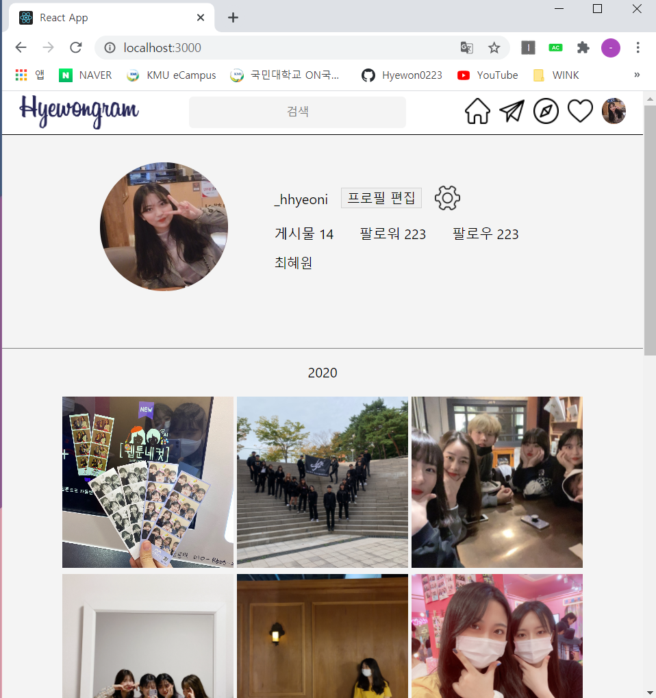
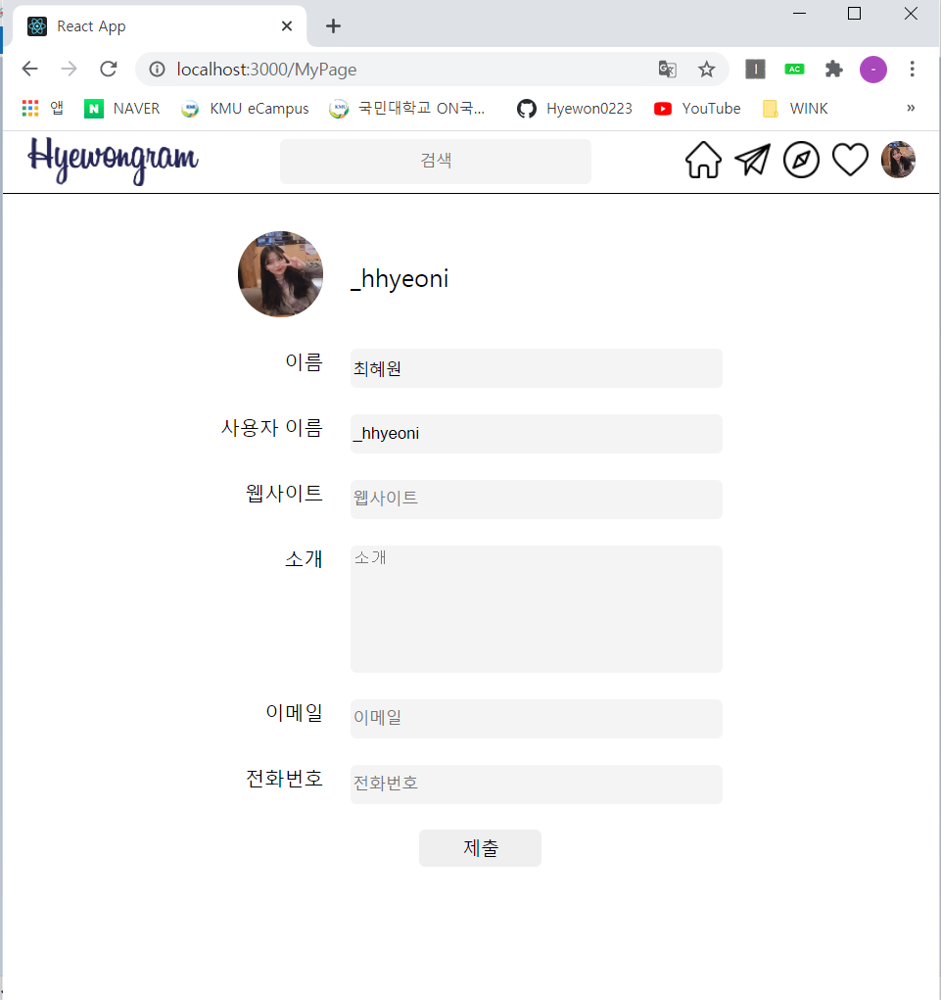

## [H05] TimeLinePage
### React를 이용한 <b>Main,TimeLine,MyPage</b> 페이지 만들기
---   
### 실행 화면
1. MainPage : 상단바 왼쪽의 홈 버튼 클릭    
   </img>   
    
2. TimeLinePage : 상단바 왼쪽의 보내기 버튼 클릭   
   </img>   
    
3. MyPage : 상단바 왼쪽의 프로필 버튼 클릭, MainPage에서 [프로필 편집] 버튼 클릭   
   </img>   
