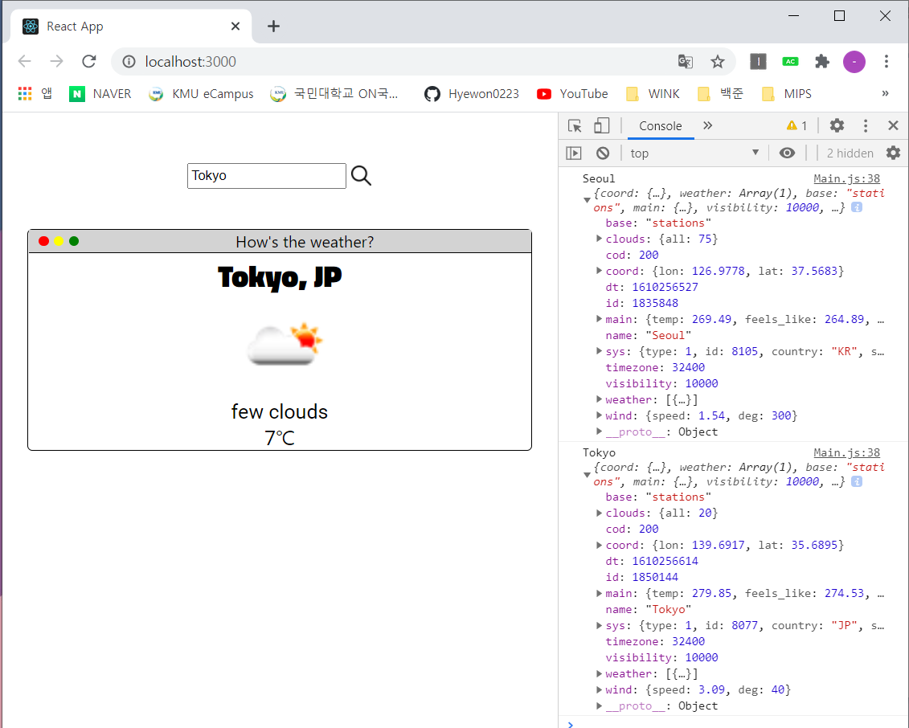

## [H06] WeatherInfo
### React, openAPI를 이용해 <b>날씨 정보</b> 받아오기   
---   
### 실행 화면
* 이미지는 2020년 1월 10일 기준   
1. 기본 페이지   
: Seoul의 날씨 정보가 default로, 이미 검색되어 날씨 정보가 나타나 있음   
</img>   
 
2. 검색 예시
   1) Sydney 검색    
   </img>   
    
   2) Tokyo 검색   
   </img>
       
3. 기능   
    1) 검색시 '검색(이미지)'버튼을 누르거나 엔터를 치면 검색이 됨   
